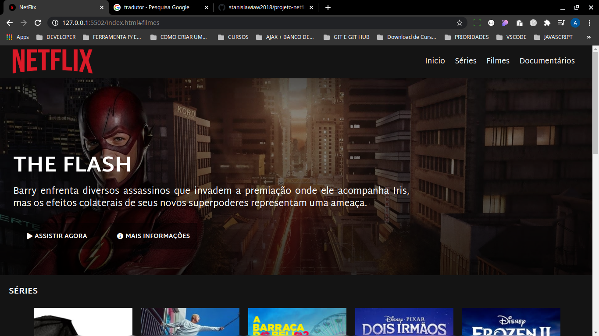

<h1 align="center">

:computer: **PROJETO NETFLIX CLONE**

</h1>

<h1 align="center">

</h1>

<h2 align="center" style="color:black"> Layout do Projeto Concluído
<h2>

<h2 align="center">

</h2>

    
    

<h5 align="center">

ÍNDICE

</h5>

## 🚀 Sobre o desafio

Desafio feito no Bootcamp de **HTML Web Developer**, que consiste na recriação do layout da pagina do NetFlix, envolvendo o conteúdo estudado durante o Bootcamp.

Nesse projeto foi recriado a interface do principal site de streaming mundial utilizando tecnologias simples como **HTML5**, **CSS3** e **JavaScript**. Nesse projeto foi visto como estruturar um layout, técnicas de CSS3 com containers e variáveis, como posicionar os elementos com Flexbox e como utilizar plugins Jquery a favor da sua aplicação, entre outros contéudos.

## 🛠️ Tecnologias Utilizadas

- HTML5;
- CSS3;
- JavaScript

 
<b>Hugo Portela</b>

